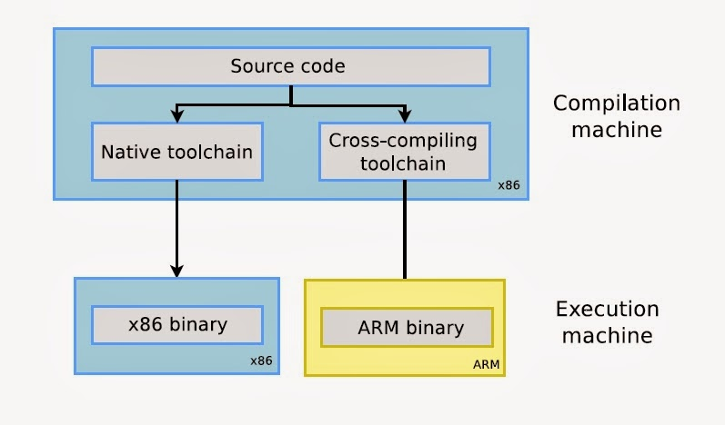
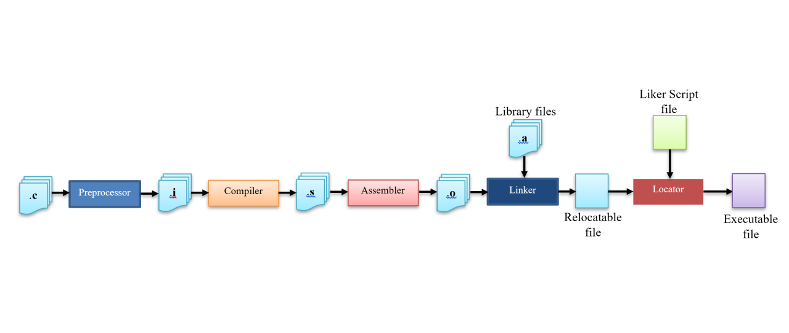

<h1 style="color:blue">  TOOLCHAIN   </h1>

<h3 style="color:orange">what is the startup code?</h3>

The reset handler or startup code is the first piece of software to execute after a system reset.Typically, the reset handler is used for setting up configuration data for the C startup code (such as address range for stack and heap memories), which then branches into the C startup code.

actions done by startup code:
<ol>
<li> load <strong>.data</strong> section fromm FLASH to RAM.</li>
<li> Resrve <strong>.bss</strong> section in RAM.</li>
<li> Initialize <strong>.bss</strong> with zeroes.</li>
<li> Initialize the stack pointer (SP)</li>
<li> Call main(Entry function) function. (it is not a must to call the entry function main but main is the common used name)</li>
</ol>

<h3 style="color:orange"> A cross-compiler </h3>

is a compiler where the target is different from the host. 

<h3 style="color:orange"> A toolchain </h3>

 is the set of binaries: compiler + linker + librarian + any other tools you need to produce the executable (+ shared libraries, etc) for the target. 

it also contains binaries to debug the application of the target

it also comes with other binaries which help you to analyze the executable:
<ol>
<li> Explain diff. sections of the executable file.</li>
<li> Disassembly.</li>
<li> Extract symbols and size.</li>
<li> convert executable into another formats.</li>
<li> provide c std libraries.</li>
</ol>

<h4> Download GCC toolchain for ARM from google:</h4>
<ol>
<li> </li>
<li> </li>
</ol>

<h4 style="color:orange"> Cross toolchain important binaries:</h4>

<ol>
<li> compiler, assembler, linker: </li>
    arm-none-eabi-gcc

<li> linker:</li>
    arm-none-eabi-ld

<li> assembler: </li>
    arm-none-eabi-as

<li> Elf file Analyser: </li>
    arm-none-eabi-objdump

<li> Format converter: </li>
    arm-none-eabi-objcopy

</ol>

<h3 style="color:orange">Build Process:</h3>

<strong style="color:white">Note:</strong> object file is relocatable (it includes processor specific machine code with no absolute address).
the true address will be assigned by the linker & linker script.

<h4> Generate object file from source file (ex: main.c)</h4>

> 
arm-none-eabi-gcc -c main.c -o main.o 

Architecture must be selected.so we add -mcpu=cortex-m4

> 
arm-none-eabi-gcc -c -mcpu=cortex-m4 main.c -o main.o

Identify if we work with mthARM instructions or Thumb instructions

> 
arm-none-eabi-gcc -c -mcpu=cortex-m4 -mthumb main.c -o main.o

-S to generate assembly file

> 
arm-none-eabi-gcc -S -mcpu=cortex-m4 -mthumb main.c -o main.s

Add libraries too
,final:

> 
arm-none-eabi-gcc -c -mcpu=cortex-m4 -mthumb -std=gnu11 main.c -o main.o 

Instead of writing all these commands in the cmd (command window), create a makefile.

makefile:

<code>

    CC = arm-none-eabi-gcc

    MACK = cortex-m4

    CFLAGS = -c -mcpu=$(MACK) -mthumb -std=gnu11

    main.o: main.c
	    $(CC) $(CFLAGS) $^ -o $@
</code>

--------------------

--------------------

-------------------

<h3 style="color:orange"> Linker and Locator</h3>

<h3>use linker to:</h3>
<ol>
<li> resolve all undefined symbols of different object files </li>
<li> merge similar sections of different object files  </li>
</ol>

<h3> use locator to</h3>
Assign the addresses ,mentioned in linker script (written by you), of the different sections.

<h6>Note:</h6> make sure that the first address is the <strong>vector table</strong>.

Analysing file:

> 
arm-none-eabi-objdump

-h, --[section-]headers  Display the contents of the section headers

> 
arm-none-eabi-objdump main.o -h 

to save it in file instead of showing it on the cmd window.

> 
arm-none-eabi-objdump main.o -h >main_log1.s

-d, --disassemble        Display assembler contents of executable sections

> 
arm-none-eabi-objdump main.o -d >main_log2.s

-D, --disassemble-all    Display assembler contents of all sections

> 
arm-none-eabi-objdump main.o -D >main_log3.s

makefile:

<code>

    CC = arm-none-eabi-gcc

    MACK = cortex-m4

    CFLAGS = -c -mcpu=$(MACK) -mthumb -std=gnu11

    main.o: main.c
	    $(CC) $(CFLAGS) $^ -o $@
	
    GPIO_prog.o: GPIO_prog.c 
	    $(CC) $(CFLAGS) $^ -o $@
</code>

<h4 style="color:orange">Loadtime:</h4>

when loading program into memory.

<h4 >LMA (load Memory Address):</h4>

Section memory address during loadtime. i.e. .data section in flash at loadtime.  

<h4 style="color:orange">Runtime:</h4>

when processor starts running the program.

<h4>VMA (Virtual Memory Address):</h4>

Section physical memory address during Runtime. i.e. .data section has a <strong>copy</strong> in RAM at Runtime.

<strong style="color:white">.data</strong> section located in Flash in loadtime but copied to RAM in runtime.

 <strong style="color:white">.bss</strong> doesnit have LMA. 

you must reserve RAM space for .bss section by knowing its size and initial address in RAM ,then initialize those memory spaces with zeroes.

This is typically done by <strong style="color:blue">"Startup code"</strong>.

Linker helps you to determine the final size of the bss section, so obtain the size information from the linkerscript symbols.

--------------------

--------------------

-------------------

<h4  style="color:orange">Importance of startup file:</h4>
<ol>
<li>responsiple for setting up the enviroment for the main user code to run. </li>
<li>code written in startup file runs before main, so startup code calls main. </li>
<li>Some parts of startup file is target dependent,like the vector table, it also may initialise the stack pointer , the way you access stack pointer is target dependent. </li>
<li>sometimes startup code may initialise some coprocessors like FPU, for some floating point operations, FPU should be turned on, otherwise it would generate exception. </li>
<li>Startup file takes care of vector table placement in code memory as required by the ARM-cortex-mx processor.. </li>
<li>Startup file may take care of stack reinitialisation. </li>
<li>Startup file is responsiple of .data and .bss sections initialisation in main memory by properly copying .data from FLASH to RAM, proper initialisation of .bss section. </li>
</ol>

<h3  style="color:orange"> startup file writing:</h3>
<ol>
Create file: <strong>STM32_F446reStartup.c </strong>
<li>Create a vector table for your MC. vector tables are MC dependent. </li>
<li>Write startup code which initialises .data and .bss sections in RAM. </li>
<li>Call main. </li>

</ol>

<h3 style="color:orange"> Creating vector table</h3>

Vector table is a collection of addresses, so we can create an array to hold MSP and handler's addresses.

This array can be of type <t style="color:red"> uint32_t. </t> 

<code style="color:cyan">
    <t style="color:red">uint32_t</t> Vectors[] = {
        MSP,
        ResetHandlerAddress,
        NMI_HandlerAddress,
        .
        .
        .
        .
    };

</code>

<h3 style="color:orange">some prolblems:</h3>

The huge number of implementations for all exceptions as it cause writing overhead and large code size.
Also application writer shouldn't write the ISR implementations inside startup file. 

<h3 style="color:orange">Solution:</h3>
<ol>

<li> A common handler for all these exceptions and IRQs called alias </li>
<li> These common handler will be as a weak function.</li>

</ol>

 All exceptions and IRQs will have the same address of the common handler except the ones who were implemented in the application.

 Alias: let the programmers to give alias name for a function.

For example:

<code style="color:cyan">
   
    /*DEFAULT HANDLER*/
    void Default_Handler(void);
    void Default_Handler(void)
    {
	    while(1);
    }

    /*HANDLER IMPLEMENTAIONS*/
    void NMI_Handler				(void) __attribute__((weak,alias("Default_Handler")));
    void HardFault_Handler			(void) __attribute__((weak,alias("Default_Handler")));
    void MemManage_Handler			(void) __attribute__((weak,alias("Default_Handler")));

</code>

 + another problem which is: the vector table will be stored in .data section ,but it should be in certain address.

 + even if you think that you can initialise .data section in this certain address ,you don't sure if vector table is placed at the first address of .data section or not.

 + the solution is to create a section for the vector table ,say: .isr_section.

+ to do so, use: <code style="color:cyan">  __ attribute__((section(".isr_vector"))) </code>

Using GNU compiler Collection -> Extensions to the C Language Family -> Common Variable Attributes -> section ("section-name") 

<strong>i.e.:</strong>

 <code style="color:cyan">
   
    uint32_t Vectors[] __attribute__((section(".isr_vector"))) =
    {
	STACK_START,
	(uint32_t)&Reset_Handler,
	(uint32_t)&NMI_Handler				   ,
	(uint32_t)&HardFault_Handler			,
	(uint32_t)&MemManage_Handler			,
    .
    .
    .
    };

</code>

you better look @ STM32_F446reStratup.c.

update makefile:

<code>

    CC = arm-none-eabi-gcc

    MACK = cortex-m4

    CFLAGS = -c -mcpu=$(MACK) -mthumb -std=gnu11

    main.o: main.c
	    $(CC) $(CFLAGS) $^ -o $@
	
    GPIO_prog.o: GPIO_prog.c 
	    $(CC) $(CFLAGS) $^ -o $@

    STM32F446reStartup.o: STM32F446reStartup.c
	    $(CC) $(CFLAGS) $^ -o $@
</code>

> 
 make STM32_F446reStartup.o

it will make an error

> 
error: 'Reset_Handler' undeclared here (not in a function);

so update startup file and implement Reset_Handler

<code>

    void Reset_Handler(void) __attribute__ ((naked, section("Random_section")));

    void Reset_Handler(void)
    {
	    /*1- Copy .data from FLASH to SRAM*/
	
	    /*2- Initialize .bss section in SRAM to zero*/
	
	    /*3- Call init function of standard library*/
	
	    /*4- Call main*/
	
    }

</code>

To test the section placement:/p>

> $ <t style="color:green"> make STM32_F446reStartup.o</t>

> $ <t style="color:green">arm-none-eabi-objdump STM32_F446reStartup.o -h</t>

Compiler by default doesn't raise warnings.

to activate warning use: -Wall

update <strong>CFLAGS</strong> in makefile.

> 
CFLAGS = -c -mcpu=$(MACH) -std=gnu11 -mthumb -Wall

We want to make clean project by deleting .o and .elf files.

it is better to use **linux** commands

open <strong>git bash</strong> as it support linux commands:

> $ <t style="color:green">rm</t>

> $ <t style="color:green">rm --help</t>

-r, -R, --recursive   remove directories and their contents recursively

-f, --force           ignore nonexistent files and arguments, never prompt

> $ <t style="color:green">rm -rf *.o *.elf</t>

add this in makefile and run make @ git bash 

<code>

    CC = arm-none-eabi-gcc

    MACK = cortex-m4

    CFLAGS = -c -mcpu=$(MACK) -mthumb -std=gnu11

    main.o: main.c
	    $(CC) $(CFLAGS) $^ -o $@
	
    GPIO_prog.o: GPIO_prog.c 
	    $(CC) $(CFLAGS) $^ -o $@

    STM32F446reStartup.o: STM32F446reStartup.c
	    $(CC) $(CFLAGS) $^ -o $@

    clean: 
	    rm -rf *.o *.elf
</code>

<h3 style="color:orange">Writing linker script:</h3>
<ol>
<li>it is a text file which explains how different sections of the object files should be merged to create o/p file.</li>

<li>Linker and locator combination assigns unique absolute addresses to different sections of the o/p file by referring to address information mentioned in the linkerscript.</li>

<li>linker script also includes the code and data memory address and size information(in linker script you mention your memories and their addresses).</li>

<li>linker scripts are written using the GNU linker command language.</li>

<li>GNU linker script has the file extension of .ld.</li>

<li>You must provide the linker with the linker script file @ the linking phase using -T option.</li>
</ol>

--------------------

--------------------

-------------------

To write a Linker script you have to understand some commands, used to explain various info in the linker script.

<h3 style="color:orange">Most important Linker script commands:</h3>

<ol>
<li>  ENTRY  </li>
<li>  MEMORY  </li>
<li>  SECTIONS  </li>
<li>  KEEP  </li>
<li>  ALIGN  </li>    
<li>  AT>  </li>
</ol>

<h4 style = "color:orange"> ENTRY command: </h4>

<ol>

 - Used to set the <strong>"entry point address"</strong> informationin the header of the final elf file generated.

- In our case, the "Reset_Handler" is the entry point into the application, first code that wxwcutes right after reset.

- Debugger uses this information to locate the first function to execute.

- Not mandatory command to use but required when you debug the elf file using the debugger GDB.

syntax: 
>  
ENTRY(Reset_Hnadler)

</ol>

    Exercise: 

    Create Stm32F446_LS.ld

    open it using any text editor for ex. NPP (notepad++).

    and write the ENTRY command

<code>
    Stm32F446_LS.ld

    ENTRY(Reset_Handler)
    
</code>

<h4 style = "color:orange"> MEMORY command: </h4>

<ol>

- This command allows you to describe diff. memories present in the target, and their start address and size info.

- The linker uses information mentioned in this command to assign addresses to merged sections (relocation).

- the information given under this command also helps the linker to calculate total code and data memory consumed so far, and throw an error message if data, code,.... areas can not fit inti available size..

- By using MEMORY command, you can fine tune various memories available in your target and allow diff. sections to occupy diff. areas.

- Typically one linkerscript has one MEMORY command.

<strong>syntax: </strong>
>  
MEMORY { label_name(attributes) : ORIGIN = origin_address, LENGTH = size }

</ol>

in side the body you can write many memory statement in this format {}.
<ol>

<h4 style="color:yellow">Attributes: R, W and X.</h4>

R: READ SECTION

W: WRITE SECTION

X: Containing executable code.

attributes an be written capital or small letters. And can be combined together.

</ol>

   <t style="color:yellow">   update the linkerscript file </t>

<code>
    Stm32F446_LS.ld

    ENTRY(Reset_Handler)
    
    MEMORY
    {

	FLASH(rx) : ORIGIN = 0x08000000 , LENGTH = 512k
	
	SRAM(rwx) : ORIGIN = 0x20000000 , LENGTH = 128k

    }
</code>

<h4 style = "color:orange"> SECTION command: </h4>

<ol>

 - SECTION command is used to create diff. o/p sections in the final elf file generated.

- By SECTION command you can instruct the linker how to merge the i/p section to yield an o/p section.

- SECTION command also controls the order in which diff. o/p sections will appear in the final elf file.

- By using SECTION command, you also mention the placement of a section in the memory region. Ex. you instruct the linker to place the .text section in the flash memory region which is described by the MEMORY command.

<strong>syntax: </strong>
>  
SECTION { section_name : {    }>(VMA) AT> (LMA) }

</ol>

 <t style="color:yellow">   update the linkerscript file </t>

<code>
    Stm32F446_LS.ld

    ENTRY(Reset_Handler)
    
    MEMORY
    {

	FLASH(rx) : ORIGIN = 0x08000000 , LENGTH = 512k
	
	SRAM(rwx) : ORIGIN = 0x20000000 , LENGTH = 128k

    }

    SECTION
    {
	    .Text:
	    {
	
	    *(.isr_vector)
	    *(.text)
	    *(.rodata)
	
	    }>FLASH

	    .data:
	    {
	
	    *(.data)
	
	    }>SRAM AT> FLASH

	    .bss:
	    {
	
	    *(.bss)
	
	    }>SRAM

}
</code>

<h4>remember:</h4>

Vector table must be at the first address @ .text. As the H.W will execute from the first place @Flash. 

<h4>Note:</h4>

To say merge .text section of input files use the wild card character.

* is the wild card character.

--------------------

--------------------

-------------------

> $ <t style="color:green">make clean</t>

> $ <t style="color:green">make STM32_F446reStartup.o</t>

> $ <t style="color:green">arm-none-eabi-gcc *.o -T Stm32F446_LS.ld -nostdlib -o final.elf</t>

> $ <t style="color:green">arm-none-eabi-objdump -h final.elf</t>

update makefile

  
<code>
  makefile

    CC = arm-none-eabi-gcc

    MACK = cortex-m4

    CFLAGS = -c -mcpu=$(MACK) -mthumb -std=gnu11 -Wall

    LDFLAGS =  -T Stm32F446_LS.ld -nostdlib -Wl,-Map=final.map

    main.o: main.c
	    $(CC) $(CFLAGS) $^ -o $@
	
    GPIO_prog.o: GPIO_prog.c 
	    $(CC) $(CFLAGS) $^ -o $@
	
    RCC_Program.o: RCC_Program.c
	    $(CC) $(CFLAGS) $^ -o $@
	
    STM32_F446reStartup.o: STM32_F446reStartup.c
	    $(CC) $(CFLAGS) $^ -o $@
	
    final.elf: main.o  GPIO_prog.o STM32_F446reStartup.o RCC_Program.o
	    $(CC) $(LDFLAGS) $^ -o $@
	
    all: main.o  GPIO_prog.o STM32_F446reStartup.o RCC_Program.o final.elf
	
    clean:
	    rm -rf *.o *.elf

</code>

<h3 style = "color:orange">Analysis ELF file</h3>

<ol>

- We can instruct the linker to create a special file called map file.by which we can analyze resources allocation and replacement in the memory.

- There is a command to instruct the linker to create mapfile.

that is why we added :

> -Wl,-Map=final.map

in LDFLAGS in makefile.

</ol>

--------------------

--------------------

-------------------

Implement the Reset_Handler:

Analyse the symboltable generated by linker:

> $<t style="color:green"> arm-none-eabi-nm final.elf</t>

With redirection into a file:

> $<t style="color:green"> arm-none-eabi-nm final.elf >symbolTable.txt </t>

<h3 style = "color:orange"> Steps to download code using OpenOCD</h3>

<ol>

<li>Download and install OpenOCD.</li>

<li>Install the client sw to talk to the OpenOCD, you can use Talnet client or GDB client.(for windows, we can use PUTTY to make Talnet connection to OpenOCD).</li>

<li>Run OpenOCD with board configuration file.</li>

<li>Connect to OpenOCD(server) via Talnet client or GDB client.</li>

<li>Issue commands over Talnet client or GDB client to OpenOCD to download and debug the code.</li>

</ol>

--------------------

--------------------

-------------------

<ol>

<li style ="color:yellow">Download and install OpenOCD.</li>

 +  google -> openOCD -> Getting OpenOCD -> Unofficial binary packages -> Windows 32/64-bit -> show all -> xpack-openocd-0.12.0-2-win32-x64.zip 
 
 > https://github.com/xpack-dev-tools/openocd-xpack/releases

 + Extrct it in our folder -> bin -> copy path -> right click om "my computer" ->  advanced system settings -> Enviroment variables -> system variables -> single click on "path" -> Edit -> New -> paste the path -> ok -> ok -> ok

 + open the downloaded folder again and follow this path <t style ="color:cyan">openocd\scripts\board</t> then search for your board

 to make sure you downloaded OpenOCD well, go back to the folder, open the git bash window 

 >$  <t style ="color:green">openocd</t>

 >$  <t style ="color:green">openocd --help</t>

 >$  <t style ="color:green">openocd -f board/st_nucleo_f4.cfg</t>

 xPack Open On-Chip Debugger 0.12.0+dev-01312-g18281b0c4-dirty (2023-09-04-22:32)
Licensed under GNU GPL v2
For bug reports, read
        http://openocd.org/doc/doxygen/bugs.html
Info : The selected transport took over low-level target control. The results mi
ght differ compared to plain JTAG/SWD
srst_only separate srst_nogate srst_open_drain connect_deassert_srst
Info : Listening on port 6666 for tcl connections
Info : Listening on port 4444 for telnet connections
Info : clock speed 2000 kHz
Error: open failed

 

update makefile with this role as load role:

<code>
makefile

    CC = arm-none-eabi-gcc

    MACK = cortex-m4

    CFLAGS = -c -mcpu=$(MACK) -mthumb -std=gnu11 -Wall

    LDFLAGS =  -T Stm32F446_LS.ld -nostdlib -Wl,-Map=final.map

    main.o: main.c
	    $(CC) $(CFLAGS) $^ -o $@
	
    GPIO_prog.o: GPIO_prog.c 
	    $(CC) $(CFLAGS) $^ -o $@
	
    RCC_Program.o: RCC_Program.c
	    $(CC) $(CFLAGS) $^ -o $@
	
    STM32_F446reStartup.o: STM32_F446reStartup.c
	    $(CC) $(CFLAGS) $^ -o $@
	
    final.elf: main.o  GPIO_prog.o STM32_F446reStartup.o RCC_Program.o
	    $(CC) $(LDFLAGS) $^ -o $@
	
    all: main.o  GPIO_prog.o STM32_F446reStartup.o RCC_Program.o final.elf
	
    clean:
	    rm -rf *.o *.elf
	
    load:
	    openocd -f board/st_nucleo_f4.cfg

</code>

 >$  <t style ="color:green">make clean</t>

 >$  <t style ="color:green">make all</t>

 >$  <t style ="color:green">make load</t>

<t style="color:red">xPack Open On-Chip Debugger 0.12.0+dev-01312-g18281b0c4-dirty (2023-09-04-22:32)
Licensed under GNU GPL v2
For bug reports, read
        http://openocd.org/doc/doxygen/bugs.html
Info : The selected transport took over low-level target control. The results mi
ght differ compared to plain JTAG/SWD
srst_only separate srst_nogate srst_open_drain connect_deassert_srst
Info : Listening on port 6666 for tcl connections
Info : Listening on port 4444 for telnet connections
Info : clock speed 2000 kHz
Error: open failed
makefile:30: recipe for target 'load' failed
make: *** [load] Error 1

</t>

<li style ="color:yellow">Install the client sw to talk to the OpenOCD, you can use Talnet client or GDB client.(for windows, we can use PUTTY to make Talnet connection to OpenOCD).</li>

</ol>

<h3 style ="color:blue">GDB</h3>

connect the board and then open two git bash terminals:

one for server:

 >$  <t style ="color:green">make load</t>

one for client:

 >$  <t style ="color:green">arm-none-eabi-gdb</t>

  >$  <t style ="color:green">target remote localhost:3333</t>

Note: the word monitor is added to the command in case of using gdb client

>$  <t style ="color:green">monitor reset init </t>

>$  <t style ="color:green">monitor flash write_image erase final.elf</t>

>$  <t style ="color:green">monitor reset halt </t>

>$  <t style ="color:green">monitor resume </t>

to get these commands use google: openocd general commands

> https://openocd.org/doc/html/General-Commands.html

at this point the application should be done.

for our application, the led is on.

now we will set a breakpoint @ GPIO_SetPinVal

>$  <t style ="color:green">monitor reset init </t>

open the symbol table to know the address of the function.

it is 0800043c 

>$  <t style ="color:green">monitor bp 0800043c  2 hw</t>

> monitor resume

to remove breakpoint:

>$  <t style ="color:green">monitor rbp all</t>

<h3 style ="color:blue">Telnet</h3>

+ Open <t style="color:cyan">PUTTY</t>

+ choose <t style="color:cyan">Telnet</t>

+ port number is <t style="color:cyan">4444</t>

+ Then press <t style="color:cyan">Open</t>